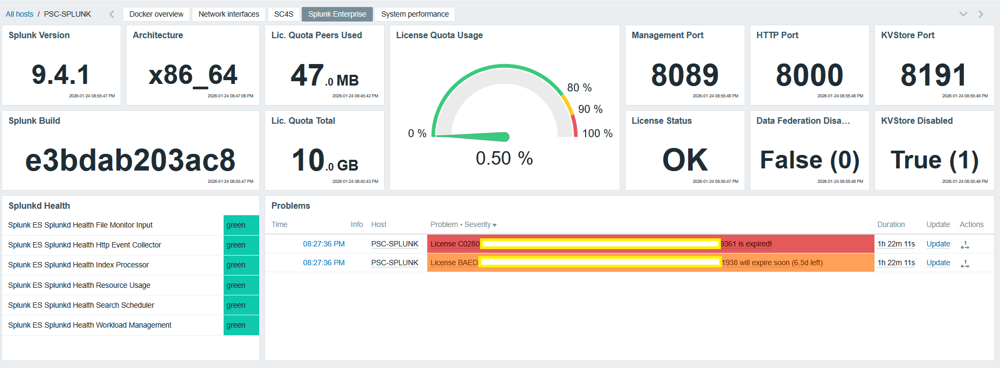

# Splunk Enterprise Monitoring for Zabbix

This repository provides a Zabbix template to monitor **Splunk Enterprise** using the **Splunk REST API**, allowing comprehensive visibility into license usage, server health, system information, and license management.

---

## 🧩 Template Overview

### 🔑 Template Splunk Enterprise by HTTPS.yaml

This template:

- Uses the **Splunk REST API v10.0** to retrieve monitoring data.
- Monitors license usage, quotas, and expiration with automatic license discovery.
- Tracks Splunk server health across multiple components.
- Collects system information and server settings.
- Is designed to minimize API usage while keeping monitoring data up to date.
- Includes preprocessing to remove sensitive information (pass4SymmKey) for security.
- Automatically filters out default Splunk licenses using regex pattern matching.

---

## 🔍 Template Purpose

Splunk Enterprise is critical for log management and security monitoring. This template allows you to:

- Monitor **license quota usage** and receive alerts at 80%, 90%, 95%, and 100% thresholds
- Track **license expiration dates** with configurable alert thresholds
- **Automatically discover all licenses** and monitor them individually
- Monitor **Splunkd health** across multiple components (File Monitor Input, HEC, Index Processor, etc.)
- Collect **system information** (version, build, architecture, license state)
- Monitor **server settings** (ports, paths, SSL configuration)
- Detect **API connectivity issues** with no-data triggers

---

## 🔐 API Permissions Required

| Endpoint | Permission Required |
|----------|---------------------|
| `/services/licenser/usage/license_usage` | Read |
| `/services/server/health/splunkd/details` | Read |
| `/services/server/info` | Read |
| `/services/server/settings` | Read |
| `/services/licenser/licenses` | Read |

---

## ⚙️ Configuration

### HTTPS Template

1. **Create a host in Zabbix**
2. **Assign the template:**  
   `Template Splunk Enterprise by HTTPS`
3. **Configure the required macros**

| Macro | Default | Description |
|------|--------|-------------|
| `{$SPLUNK.ENTERPRISE.API.BASEURL}` | — | Splunk API URL (e.g., `https://mysplunk.com:8089`) |
| `{$SPLUNK.ENTERPRISE.API.USER}` | — | Splunk API username |
| `{$SPLUNK.ENTERPRISE.API.PASSWORD}` | — | Splunk API password |
| `{$SPL.ENTERPRISE.LIC.NOTMATCHES}` | `^F+D*$` | Regex to filter out default Splunk licenses (only contains 'F' or 'F' and a ending 'D') |
| `{$SPLUNK.ENTERPRISE.LICEXP.DAYS_INFO}` | `60` | Informational expiration threshold |
| `{$SPLUNK.ENTERPRISE.LICEXP.DAYS_WARN}` | `30` | Warning severity expiration threshold |
| `{$SPLUNK.ENTERPRISE.LICEXP.DAYS_AVG}` | `15` | Average severity expiration threshold |
| `{$SPLUNK.ENTERPRISE.LICEXP.DAYS_HIGH}` | `5` | High severity expiration threshold |
| `{$SPLUNK.ENTERPRISE.LICEXP.DAYS_CRITICAL}` | `1` | Critical severity expiration threshold |

**Ignored Licenses:**
- FFFFFFFFFFFFFFFFFFFFFFFFFFFFFFFFFFFFFFFFFFFFFFFFFFFFFFFFFFFFFFFD
- FFFFFFFFFFFFFFFFFFFFFFFFFFFFFFFFFFFFFFFFFFFFFFFFFFFFFFFFFFFFFFFF

If you want to monitor this licenses just set the macro `{$SPL.ENTERPRISE.LIC.NOTMATCHES}` to empty value.

---

## 🔁 Discovery

- **Automatically discovers all available licenses** using LLD.
- **Filters out default Splunk licenses** using regex pattern `{$SPL.ENTERPRISE.LIC.NOTMATCHES}` (default: `^F+D*$`)
- Discovery macro: `{#SPL.ENTERPRISE.LIC.NAME}`
- Creates comprehensive monitoring items and triggers **per discovered license**.
- Discovery runs every hour with 6-hour disable after period to conserve resources.

---

## 📦 Monitoring Items

### Global License Monitoring
- License quota usage (peers, slaves, total)
- License quota used percentage (calculated)
- Overall license statistics

### Per-License Monitoring (Discovered)
- License creation time
- License expiration time
- Days left to expiration (calculated)
- Group ID and subgroup ID
- License label and notes
- Quota size and status
- License type and window period
- Max users and violations
- Unlimited license flag
- Retention size

### Server Health Monitoring
- Overall Splunkd health
- File Monitor Input health
- HEC (Http Event Collector) health
- Index Processor health
- Resource Usage health
- Search Scheduler health
- Workload Management health

### System Information
- Splunk version and build
- CPU architecture
- License state
- Forwarding status
- Server paths (SPLUNK_HOME, SPLUNK_DB)

### Server Settings
- HTTP port
- KV Store port and status
- Management host port
- SSL configuration
- Data federation status
- Session token settings

---

## 🚨 Triggers

### License Quota Triggers
| Trigger | Condition | Severity |
|---------|-----------|----------|
| Splunk License quota usage is 100% | quota_used_perc >= 100% | Disaster |
| Splunk License quota usage is over 95% | quota_used_perc > 95% | High |
| Splunk License quota usage is over 90% | quota_used_perc > 90% | Average |
| Splunk License quota usage is over 80% | quota_used_perc > 80% | Warning |

### License Expiration Triggers (per discovered license)
| Trigger | Condition | Severity |
|---------|-----------|----------|
| License {#SPL.ENTERPRISE.LIC.NAME} is expired! | days_to_expire < 0 | Disaster |
| License {#SPL.ENTERPRISE.LIC.NAME} will expire soon | days_to_expire < DAYS_CRITICAL | Disaster |
| License {#SPL.ENTERPRISE.LIC.NAME} will expire soon | days_to_expire < DAYS_HIGH | High |
| License {#SPL.ENTERPRISE.LIC.NAME} will expire soon | days_to_expire < DAYS_AVG | Average |
| License {#SPL.ENTERPRISE.LIC.NAME} will expire soon | days_to_expire < DAYS_WARN | Warning |
| License {#SPL.ENTERPRISE.LIC.NAME} will expire soon | days_to_expire < DAYS_INFO | Info |

### API Connectivity Triggers
| Trigger | Condition | Severity |
|---------|-----------|----------|
| Splunk API License: No data for more than 30min | No data for 30 minutes | High |
| Splunk API Server Health: No data for more than 30min | No data for 30 minutes | High |
| Splunk API Server Info: No data for more than 30min | No data for 30 minutes | High |
| Splunk API Server Settings: No data for more than 30min | No data for 30 minutes | High |

---

## 🔧 Key Features

### License Discovery & Filtering
- **Automatic license discovery** every hour
- **Smart filtering** to exclude default Splunk licenses (those containing only 'F')
- **Configurable regex filter** via `{$SPL.ENTERPRISE.LIC.NOTMATCHES}` macro

### Security Features
- **Sensitive data removal** - pass4SymmKey fields are automatically stripped
- **BASIC authentication** support
- **Secure credential handling** through Zabbix macros

### Performance Optimization
- **Dependent items** minimize API calls
- **Discard unchanged heartbeat** preprocessing reduces database load
- **Efficient polling intervals** (5m for critical items, 1d for static data)
- **Discovery disable after** feature prevents orphaned items

---

## 🖥️ Monitoring Views

The template provides comprehensive monitoring through:
- **License overview** with quota usage and expiration tracking
- **Per-license detailed views** for enterprise deployments
- **Server health dashboard** showing all component statuses
- **System information view** for version and configuration tracking
- **Discovered license inventory** for license management

---

## 📊 Use Cases

- **License management** - Track usage, quotas, and expirations across all licenses
- **Capacity planning** - Monitor license quota usage trends
- **Compliance monitoring** - Ensure licenses are active and valid
- **System health** - Monitor Splunk component availability
- **Change tracking** - Monitor configuration and version changes
- **Alerting** - Proactive notifications for license and health issues

---

## 📦 Compatibility

- Tested with **Zabbix 7.4**
- Compatible with **Splunk Enterprise 10.0** REST API
- Supports multiple license monitoring for enterprise environments
- Works with Splunk Enterprise Security (ES) deployments

---

## 📝 Notes

- **Default licenses filtering**: The template automatically filters out Splunk's default licenses (those with names like 'F') using regex pattern matching
- **Security**: All API calls use BASIC authentication with preprocessing to remove sensitive fields
- **Calculated items**: Provide derived metrics (percentage usage, days to expiration)
- **Dependency chains**: Ensure proper trigger escalation and reduce false positives
- **Data retention**: Health and info items retain data for 30 days, raw items store no history

---

## 📅 Releases

### Current Version
- **Automatic license discovery** with smart filtering
- **Comprehensive Splunk Enterprise monitoring** template
- **HTTPS-based API integration** using REST endpoints
- **Per-license monitoring** with detailed metrics
- **Server health, system info, and settings monitoring**
- **Configurable alert thresholds** for license usage and expiration
- **Security enhancements** with sensitive data removal
- **Performance optimizations** with efficient polling and preprocessing